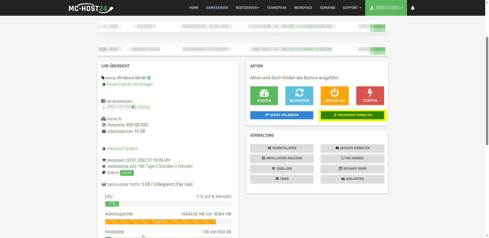

# Speicherplatz Erweitern

Hier ist eine kurze Anleitung, wie du den Speicher bei einem Windows Server erweitern kannst:

1. Auf diesem Bild wir dir gezeigt wie du den Speicherplatz auf der Meine Server Seite erweitertes. Als Erstes gehst du auf die Meine Server Seite 

